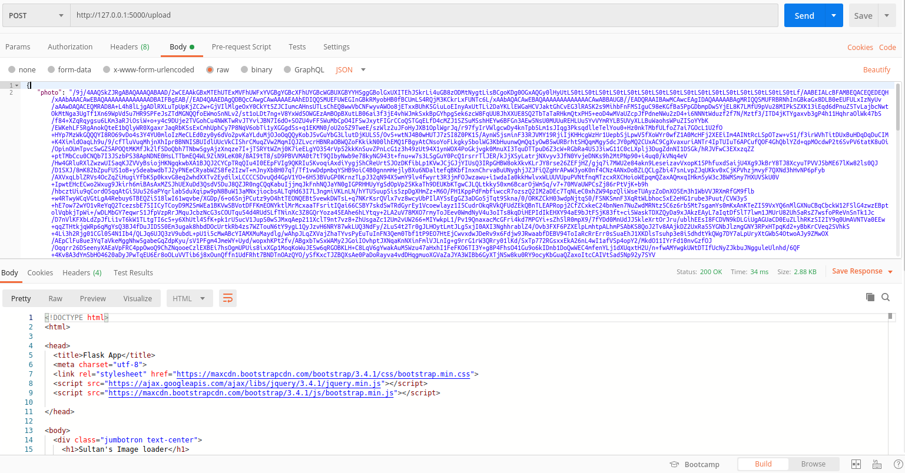

# Web server with image uploading functionality using Flask
Home path: `http://127.0.0.1:5000/` 

To upload image submit post request on `http://127.0.0.1:5000/upload`

[Instructions for Ubuntu]

Make sure you have installed:

`python3 -m pip install --user virtualenv`

### Setup

Go to root folder of the project

1) via Docker:

`docker build -t test-task:latest .`

`docker run -d -p 5000:5000 test-task:latest`

and the server should be accessed from `http://127.0.0.1:5000/`

2) via Python's virtual environment, run the following commands:

`apt-get update -y`

 `apt-get install -y python3 python3-dev python3-pip wget`
 
 `apt-get remove -y python-pip python3-pip`
 
 `wget https://bootstrap.pypa.io/get-pip.py`
 
 `python3 get-pip.py`
 
 `python3 -m venv env`
 
 `source env/bin/activate`
 
 ` pip3 install -r requirements.txt `
 
 and run `src/app.py` script
 
 ___________________________________
 
 Three options to upload a picture:
 - Use "choose files"  button (single as well as multiple file upload)
 - Supply image URL to the text form below
 - Post base64 string image via JSON request. Can be accomplished with Postman as an example, below:
 
 

